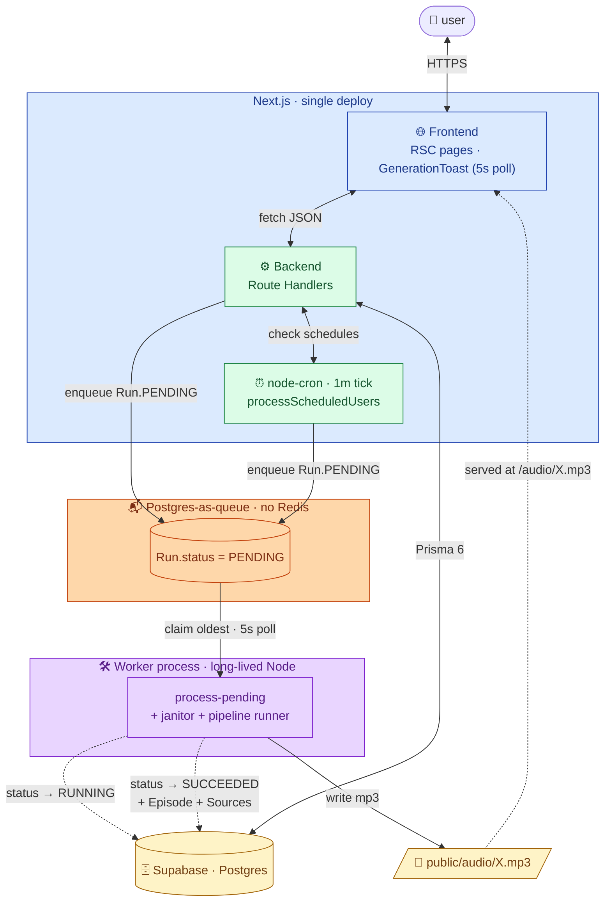
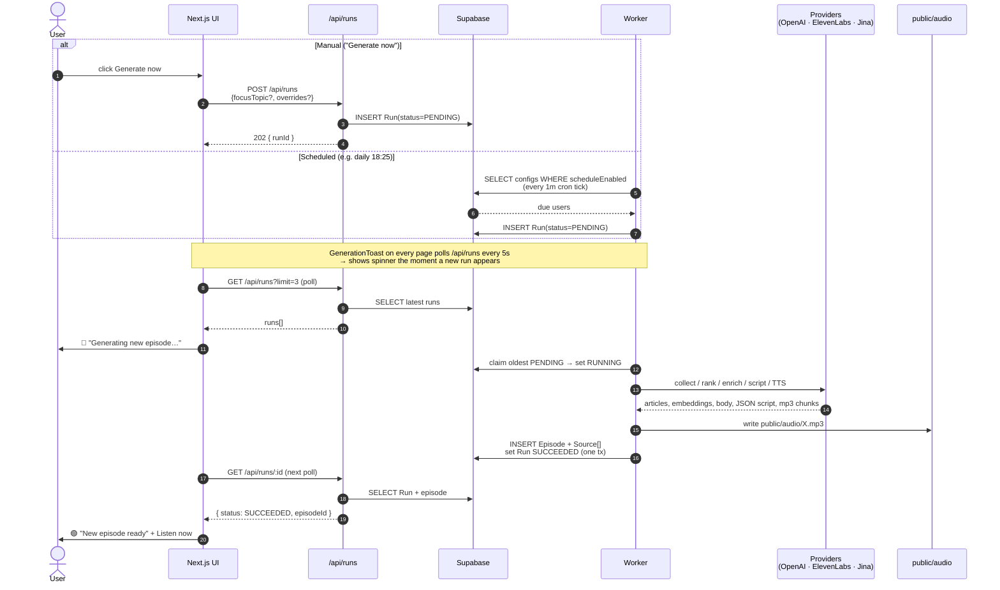
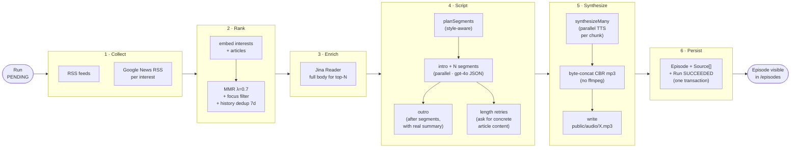
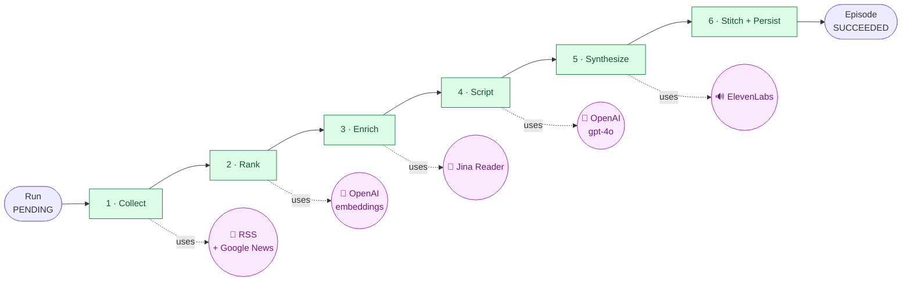

# Solution overview

A personal news-podcast generator. The user describes what they want to hear about in natural language; the system fetches fresh news on those topics, writes a co-host script grounded in the source articles, synthesizes the audio with ElevenLabs, and surfaces the episode in a Spotify-style listener UI with a click-to-seek transcript. Generation can be triggered on demand (with per-episode overrides) or on a per-user daily schedule.

Stack: Next.js 15 (App Router) + Prisma 6 / Postgres (Supabase) + Node worker with `node-cron`. OpenAI for embeddings + script + interest extraction; ElevenLabs for TTS; Jina Reader for free article enrichment. Pure pnpm, strict TypeScript, ESLint clean.

---

## Architecture at a glance

### The shape, in one paragraph

A typical Next.js full-stack app **plus** a long-lived Node worker. They share a single managed Postgres on Supabase as the source of truth — the web app writes `Run(PENDING)` rows, the worker picks them up and runs the pipeline. There is no Redis, no queue, no message bus: Postgres is the queue. Every third-party call (OpenAI, ElevenLabs, Jina, Google News) lives behind `src/providers/`* so the rest of the codebase has zero vendor coupling.

### Stack & why


| Layer      | Choice                                             | Why this, not the alternative                                                                                                                                                                                                                                                                                         |
| ---------- | -------------------------------------------------- | --------------------------------------------------------------------------------------------------------------------------------------------------------------------------------------------------------------------------------------------------------------------------------------------------------------------- |
| Frontend   | Next.js 15 App Router (React Server Components)    | Same repo + same TypeScript types as the API. RSCs let the homepage / episode page query the DB directly with no extra fetch hop.                                                                                                                                                                                     |
| API        | Next.js Route Handlers                             | Co-located with the UI; no separate backend service to deploy for the MVP scope.                                                                                                                                                                                                                                      |
| Worker     | Long-lived Node process · `node-cron`              | Episode generation is long-running (LLM + TTS), retries-needed, scheduled. Serverless function timeouts make that a poor fit.                                                                                                                                                                                         |
| Database   | **Supabase** managed Postgres + Prisma 6           | Relational domain (user→interests, run→episode→sources). Supabase is zero-infra for the demo; everything is plain Postgres so swapping to RDS/Cloud SQL is a connection-string change. Pooler discipline (`?pgbouncer=true&connection_limit=1`) + transient-error retry middleware are baked into `src/db/client.ts`. |
| Queue      | Postgres rows (`Run.status=PENDING`)               | BullMQ-style semantics without Redis. Polled every 5s. Migrating to BullMQ later is a localized change in `worker/jobs/process-pending.ts`.                                                                                                                                                                           |
| Audio      | Local FS in dev, S3-compatible in prod             | Local keeps dev frictionless; the path is abstracted so prod swap is one provider file.                                                                                                                                                                                                                               |
| LLMs       | OpenAI gpt-4o + text-embedding-3-small             | Embeddings for ranking, gpt-4o with `response_format: json_schema` for the script, `web_search_preview` for interest extraction. Provider isolation makes swapping to Claude / GPT-5 / gpt-4.1 trivial.                                                                                                               |
| TTS        | ElevenLabs `eleven_multilingual_v2`                | Best ES + EN voice naturalness in our tests. `synthesizeMany` parallelizes per-chunk; byte-concat of CBR mp3 frames stitches without ffmpeg.                                                                                                                                                                          |
| Enrichment | Jina Reader (`r.jina.ai`)                          | Free, no key, returns clean article body. Cheapest way to give the script substance to cite beyond the snippet.                                                                                                                                                                                                       |
| Scheduling | `node-cron` (1-min tick) + per-user schedule in DB | The cron tick is just a poller for "which users are due now in their TZ?" — one cheap DB query. No per-user cron registrations to manage at runtime.                                                                                                                                                                  |


### System overview — components by layer

Colors highlight the layer each component belongs to. Supabase is explicitly the only stateful service we own — everything stateless can be redeployed at will.

```mermaid
flowchart TB
  User((👤 User<br/>browser))

  subgraph FE["🌐 Frontend"]
    Pages["Listener UI + Dashboard<br/>RSC pages"]
    Toast["GenerationToast<br/>(global · polls for runs)"]
  end

  subgraph BE["⚙️ Backend"]
    API["API routes<br/>/api/runs · /api/config<br/>/api/interests"]
    subgraph Worker["Worker process · node-cron"]
      Cron["⏰ Cron tick · 1m<br/>processScheduledUsers"]
      Poll["🔁 Poll · 5s<br/>processPendingRuns"]
      Janitor["🧹 Janitor · 60s<br/>sweepStaleRuns"]
      Pipeline["🛠️ runPipeline(ctx)<br/>6 retryable stages"]
    end
  end

  subgraph Data["💾 Data layer"]
    DB[("🗄️ Supabase · Postgres<br/>users · interests<br/>configs (+schedule)<br/>runs · episodes · sources")]
    FS[/"📂 public/audio/X.mp3<br/>(local FS dev · S3 prod)"/]
  end

  subgraph Ext["☁️ External providers"]
    OpenAI["🤖 OpenAI<br/>embeddings + script<br/>+ interest extract"]
    Eleven["🔊 ElevenLabs<br/>TTS multilingual_v2"]
    Jina["📄 Jina Reader<br/>article bodies"]
    News["📰 RSS + Google News<br/>(+ URL decoder)"]
  end

  User --> Pages
  Pages <-->|HTTPS / JSON| API
  Toast -. polls .-> API
  API <-->|Prisma| DB
  API -->|create Run PENDING| DB

  Cron -->|read users due now| DB
  Cron -->|create Run PENDING| DB
  Poll -->|claim oldest PENDING| DB
  Poll --> Pipeline
  Janitor --> DB

  Pipeline -->|update Run state| DB
  Pipeline --> News
  Pipeline --> OpenAI
  Pipeline --> Jina
  Pipeline --> Eleven
  Pipeline -->|write mp3| FS

  FS -. served at /audio/X.mp3 .-> Pages

  classDef frontend fill:#dbeafe,stroke:#1e40af,color:#1e3a8a;
  classDef backend  fill:#dcfce7,stroke:#15803d,color:#14532d;
  classDef data     fill:#fef3c7,stroke:#a16207,color:#713f12;
  classDef external fill:#fae8ff,stroke:#a21caf,color:#701a75;
  class FE,Pages,Toast frontend;
  class BE,API,Worker,Cron,Poll,Janitor,Pipeline backend;
  class Data,DB,FS data;
  class Ext,OpenAI,Eleven,Jina,News external;
```

### Request flow — how a job moves through the queue

The diagram above lists **what exists**. This one shows **how it flows**: a typical request — manual or scheduled — drops a `Run(PENDING)` row, the worker claims it, the pipeline runs, status updates back to the DB. The same row is the queue, the state machine, AND the source of truth — no Redis, no broker, no messaging tier.



Migrating to BullMQ + Redis later would only touch the **Queue box** and the **WorkerProc's poll loop** — the Next.js app and the pipeline don't change.


### Lifecycle of a single episode (manual OR scheduled)

The two trigger paths converge as soon as a `Run(PENDING)` row exists in Postgres. After that point everything is identical.




### Pipeline — the heart

Six discrete, retryable stages with explicit `Stage<I,O>` contracts. A stage failure logs full context (`runId`, `userId`, stage) and is retried at that step — never re-running (and re-paying for) the whole episode. Costs are concentrated in stages 4 + 5; earlier stages are nearly free (RSS gratis, embeddings ~$0.0001 per article, Jina gratis).



### Pipeline at a glance — stages + providers

Same six stages, drawn as a clean linear chain with the provider each one calls — plus a stage-by-stage cheat sheet underneath. Use this when you want the high-level view; use the diagram above when you want the internal steps of each stage.



| Stage             | What it does                                                                                                              | Notes                                                                                            |
| ----------------- | ------------------------------------------------------------------------------------------------------------------------- | ------------------------------------------------------------------------------------------------ |
| **1 · Collect**   | Broad shortlist of fresh news: ~8 reliable RSS feeds + a Google News RSS query per user interest.                          | Google News URLs are wrappers — a custom decoder resolves them to the real outlet URL so Jina can enrich. |
| **2 · Rank**      | Embed interests + articles (`text-embedding-3-small`), score with **MMR λ=0.7** for relevance × diversity, apply focus-topic hard filter (≥0.30 cosine), dedup against 7-day history. | When a focus is set we never pad with off-topic articles — better a tight 3-segment episode than 6 mixed. |
| **3 · Enrich**    | Fetch full article body via **Jina Reader** (`r.jina.ai`, free, no key) for the top-N ranked articles.                     | Without this, the script can only paraphrase snippets → low groundedness scores.                  |
| **4 · Script**    | gpt-4o with `response_format: json_schema`. Per-section: intro + N segments (parallel) → outro (after, with real segment summary). Length-aware `OVERSHOOT` (1.15 → 1.35) + structured expand-retries. | Named-entity rule + post-processing safety nets (strip placeholders, greetings, speaker labels). |
| **5 · Synthesize** | ElevenLabs `eleven_multilingual_v2`. `synthesizeMany` runs TTS for each chunk (intro + each segment + outro) in parallel. All chunks request `mp3_44100_128`. | CBR same-format chunks → safe to byte-concat without re-encode.                                  |
| **6 · Stitch + Persist** | `Buffer.concat()` of the CBR mp3 frames → `public/audio/<runId>.mp3`. One Prisma transaction: insert `Episode` + `Source[]` + flip `Run.SUCCEEDED`. | No ffmpeg dependency. Idempotent on `runId` — retrying a stage that already persisted is a no-op. |

> Diagrams use Mermaid — they render natively in GitHub, GitLab, VS Code preview, Obsidian, Notion, and most modern markdown viewers.

---

## What the product does, end-to-end

1. **Onboarding** — 4 steps: welcome, interests (free-text description → LLM extracts `{topic, weight, context}` with `web_search_preview` so "Shaboozey" comes back as "American country/hip-hop artist"), format/length/voice, and the first generation.
2. **Generate** — from the homepage, the user clicks **Generate now** (optionally picking a focus interest + per-episode overrides for length / format / style) or sets a daily schedule in settings.
3. **Pipeline** runs on a worker process:
  - **Collect** — broad RSS shortlist + per-interest Google News search (with a custom decoder for the new wrapper URL format).
  - **Rank** — embeddings + MMR (λ=0.7) for relevance × diversity; hard filter by `FOCUS_MIN_SIM` when a focus is set, so a "Shaboozey episode" doesn't pad with unrelated AI/F1 stories.
  - **Enrich** — Jina Reader fetches full body text (free, no key) for the top-N.
  - **Script** — gpt-4o with `json_schema`, per-section (intro / N segments / outro), strict word budgets, named-entity-rule-aware prompts.
  - **Synthesize** — ElevenLabs `synthesizeMany` parallelizes per-chunk TTS (intro + each segment + outro) and stitches them with byte-concat of CBR mp3 frames — no ffmpeg dependency.
  - **Persist** — atomic transaction creates `Episode` + `Source[]` + flips `Run.SUCCEEDED`. Idempotent on `runId`.
4. **Listen** — `/episodes/[id]` plays the audio with a synced transcript: each line is clickable to seek, manual scroll temporarily pauses auto-follow, and a "Jump to current" button re-engages it. A **Download** button serves the mp3 with a friendly filename like `podcast-2026-05-31-shaboozey.mp3`.
5. **Surface** — internal `/dashboard` shows live metrics (episodes/week, success rate, average generation time, avg cost per episode) alongside clearly-marked MOCK metrics (listen-through, downloads).

---

## Key architectural decisions

Each decision is recorded as **what → why → tradeoff → revisit when**.

### Pipeline as discrete `Stage<I,O>` modules

Each stage has typed inputs/outputs, lives in its own file, and is retryable independently. The orchestrator (`src/pipeline/index.ts`) updates `Run.status` as stages progress so the worker and the API stay in sync. Tradeoff: more orchestration code than one monolithic function; payoff: failures retry at the failing step instead of re-running (and re-paying for) the whole episode.

### Three-stage news sourcing (vs single research agent)

The first iteration used a single OpenAI research agent. It worked, but it conflated "find news", "rank news", and "summarize news" into one expensive call. The current chain — broad RSS+Google News → embedding+MMR rank → Jina enrich — is cheaper, produces more material to cite, and lets the script call cite full bodies (not synopses). The research agent is retained but unwired; it remains a useful fallback when RSS is dry.

### `node-cron` + Postgres-as-queue (not BullMQ + Redis)

The worker has a per-minute cron tick that fires `processScheduledUsers` (per-user schedule check) and a 5-second poll loop for `Run(status=PENDING)` rows the API created. This is BullMQ semantics without the Redis infrastructure. Tradeoff: in-process, single worker, no exponential backoff. Acceptable for MVP; we'd move to BullMQ + Redis as soon as we need concurrent workers or job persistence beyond a single process.

### Stitched TTS by byte-concat (not ffmpeg)

The synthesize stage splits the script into chunks (intro + each segment + outro) and calls ElevenLabs in parallel. Each chunk is requested at the same codec/bitrate/sample rate (`mp3_44100_128`), so `Buffer.concat()` produces a valid mp3 without re-encoding — CBR mp3 frames are self-synchronizing. Cuts TTS latency from ~80s to ~15s on a typical 6-segment 15-min script, and avoids the `fluent-ffmpeg` dependency. Tradeoff: no music beds, transitions, or per-segment voice changes without re-introducing ffmpeg.

### Supabase Postgres with explicit pooler discipline

`DATABASE_URL` includes `?pgbouncer=true&connection_limit=1` to play nicely with Supabase's transaction-mode pooler. `DIRECT_URL` (session pool) is used by Prisma for migrations only. The Prisma client in `src/db/client.ts` is wrapped with `$extends` to transparently retry transient `P1001/P1002/P1008/P1017` codes — without it, Supabase pooler drops surface as 500s after idle periods. `NonRetriableError` is thrown for quota/auth errors so the stage retry loop doesn't burn API budget chasing impossible recoveries.

### Provider isolation

Every vendor call lives under `src/providers/`*. Application code (pipeline, evals, API routes) never imports `openai` or `@elevenlabs/...` directly. This let us:

- Swap from a research agent to a multi-source chain without touching the rest of the pipeline.
- Add per-stage dry-run stubs that return canned data so `pnpm test` and `pnpm eval` never spend API credits.
- Add the Google News URL decoder (Reader-blocked wrappers → real outlet URLs) as a transparent fix to one file, with no caller changes.

### Per-run overrides on top of saved `PodcastConfig`

Settings stores the user's baseline (voice, format, length, tone, style, density, language, schedule). `Run` rows carry optional `overrideTargetLengthMin / overrideFormat / overrideStyle` so the homepage can offer "give me a 20-min deep-dive on this one focus" without forcing a trip to Settings. `process-pending.ts` applies overrides on top of the saved config when building the run context. When the override flips to a multi-speaker format and no `secondaryVoice` is saved, it auto-picks a different voice rather than falling back to mono.

### Per-user schedule with day-of-week + timezone

`PodcastConfig` carries `scheduleEnabled / scheduleHour / scheduleMinute / scheduleDays[] / scheduleTimezone / lastScheduledRunAt`. The worker's cron tick (every minute) calls `processScheduledUsers`, which uses `Intl.DateTimeFormat(...timeZone)` (Node-native, DST-aware, no dependencies) to compute each user's local time and fires if (a) today is in `scheduleDays`, (b) current local time ≥ scheduled time, and (c) `lastScheduledRunAt` is on a different local day. The "different local day" gate guarantees once-per-day semantics regardless of cron granularity, worker restarts, or DST transitions. Schedules and manual generates coexist — if a manual run is already in-flight when the schedule fires, the scheduled fire is skipped (and `lastScheduledRunAt` still stamps so we don't keep checking every tick). The 1-minute cadence costs one cheap `SELECT WHERE scheduleEnabled` per tick — trivial Postgres load — and gives schedule slots a ≤60s firing latency in practice.

---

## Quality story — how we handle the hallucination problem

This is the most-worked-on part of the system. A generative news podcast lives or dies on whether the script is grounded in real, current news. Several layered defences:

### Prompt structure

- The script generator splits work into intro / N segments / outro, each with its own narrow word budget. Smaller scope per call = tighter prose.
- Each segment is fed ONLY its own article(s). Segments don't cross-pollute (a fix for an earlier bug where Verstappen stories were leaking into Shaboozey segments).
- A topic-agnostic **named-entity rule** in the segment prompt distinguishes **names** (free to use for context, color, analogy) from **claims** (must come from the article body OR be a settled historical fact). The model's own knowledge is explicitly framed as "months out of date — untrustworthy for current state". This catches things like "Hamilton, who's at Mercedes" — the name is fine, the *current-team* claim is not.
- Hedging words (potentially, might, could, depending on) are explicitly called out as **not an escape hatch** for unsupported claims.
- The intro forbids the model from inventing a podcast name (an earlier failure produced "Welcome to [Podcast Name]!" verbatim) and forbids subsequent segments from re-introducing the show (the "double intro" failure).
- A length-aware `OVERSHOOT` factor scales from 1.15 (5 min target) to ~1.35 (20 min target) because GPT-4o's underdelivery grows with length. The expand-retry asks for **specific kinds of new content** ("a number from the body", "a quote the article attributes to X", "a mechanism the body explains") rather than generic "make it longer" — converts a retry the model often half-rejects into one it can actually execute. The retry's hard rules are ordered: grounding > length, so a thin article produces a slightly short grounded segment rather than a target-length fabricated one.

### Post-processing safety nets

- `stripSpeakerPrefix` removes leaking labels like "Rachel:", "A:", "[Host]" that TTS would otherwise read aloud.
- `stripGreetingOpener` strips a "Hey everyone, welcome back!" pattern from the first line of a segment.
- `stripPlaceholders` removes bracketed template patterns (`[Podcast Name]`, `<Show Title>`) the model occasionally leaks.

### Evals (`pnpm eval`)

Three layers, run against fixed article fixtures in dry-run so they cost almost nothing and are deterministic enough to gate changes:

- **Layer A — deterministic checks**: length budget, structure, every claim carries a source URL, no duplicate segments, banned phrases, citation validity.
- **Layer B — groundedness-entailment**: per-line LLM judge (gpt-4o-mini) classifies each line into 5 verdicts: `no_claim` (glue), `supported` (literally in article), `paraphrase` (true to article), `general_knowledge` (plausibly true background not in article), `hallucinated` (contradicts or invents). Hallucination rate = `hallucinated / (supported + paraphrase + general_knowledge + hallucinated)`; PASS ≥ 0.95.
- **Layer C — LLM-as-judge rubrics**: per-axis scoring on tone, engagement, coverage, plus a style-specific axis (breadth for news-roundup, depth for deep-dive, editorial-glue for magazine). gpt-4o-mini at temperature 0 with explicit rubrics.

Every episode's eval scores are persisted (`Episode.evalScoreJson`) so the dashboard can chart quality over time.

---

## UX surface

- **Homepage** — `Generate now` button with focus-topic picker and per-episode overrides (length / format / style); recent episodes list.
- **Onboarding** — 4 steps; natural-language interest input goes through `web_search_preview` to extract `{topic, weight, context}` so future scripts know "shaboozey" is an artist; voice preview samples.
- **Settings** — interests (merge-on-extract, not replace), format/voice, and per-user schedule (toggle + time picker + day-of-week buttons + IANA timezone select with browser-detected default marked "(your time)").
- **Episode page** — Spotify-style transcript: click any line to seek; manual scroll pauses auto-follow until you press "Jump to current"; download mp3 button (uses native `<a download>`, filename includes date + focus topic if set).
- **Generation toast** — global client component mounted in the listener layout. It polls `/api/runs` every 5s and follows a run through its full lifecycle: as soon as a new `PENDING` or `RUNNING` row appears (whether the user clicked "Generate now" or a schedule fired silently), it surfaces a bottom-right toast with a spinner ("Generating new episode…"). When that same run reaches `SUCCEEDED` it upgrades to "New episode ready" with a "Listen now" link to the episode page. `FAILED` surfaces the error message. Dedup is via a bounded `seenRunIds` set in `localStorage`, and a mount-time watermark in `sessionStorage` prevents toasts for old runs after a reload.
- **Dashboard** — `/dashboard`, marked internal. Each metric carries a `LIVE` or `MOCK` badge so it's honest about what's real data vs placeholder.

---

## What's intentionally out of scope

- **Auth** — single hard-coded `demo-user`. Real auth would slot in via Supabase Auth or NextAuth without changing the data model (the user FK is already there).
- **Audio storage in S3** — local FS in dev. Production would write to S3-compatible storage; the abstraction would live in a new `src/providers/storage.ts`.
- **Listen-through / downloads tracking** — would require client-side event posting; left as MOCK on the dashboard with a clear label.
- **BullMQ + Redis** — see decision above; the current `node-cron` + Postgres-queue is sufficient for the MVP demo and could be swapped without touching the pipeline.
- **Multi-worker / horizontal scaling** — single worker is fine for a demo; `processPendingRuns` has a local `isBusy` flag to avoid double-processing within one worker, but cross-worker locking would need DB advisory locks.
- **Janitor for runs stuck >10 min** — implemented at boot + every 60s in the worker (`sweepStaleRuns`), so this isn't actually out of scope, but worth flagging that it exists.

---

## How to run

```bash
pnpm install
cp .env.example .env  # fill OPENAI_API_KEY, ELEVENLABS_API_KEY, DATABASE_URL, DIRECT_URL
pnpm exec prisma migrate dev
pnpm dev      # Next.js: UI + dashboard + API
pnpm worker   # cron + pending-poller + scheduled-users + janitor
```

Common scripts:

- `pnpm test` — unit tests (mocked providers)
- `pnpm eval` — quality evals against fixed fixtures (dry-run, no API spend)
- `pnpm typecheck` — `tsc --noEmit`
- `pnpm lint` — ESLint
- `pnpm exec prisma studio` — inspect the DB

For dry-run end-to-end without spending API credits: `DRY_RUN=true pnpm worker` returns canned data from every provider.